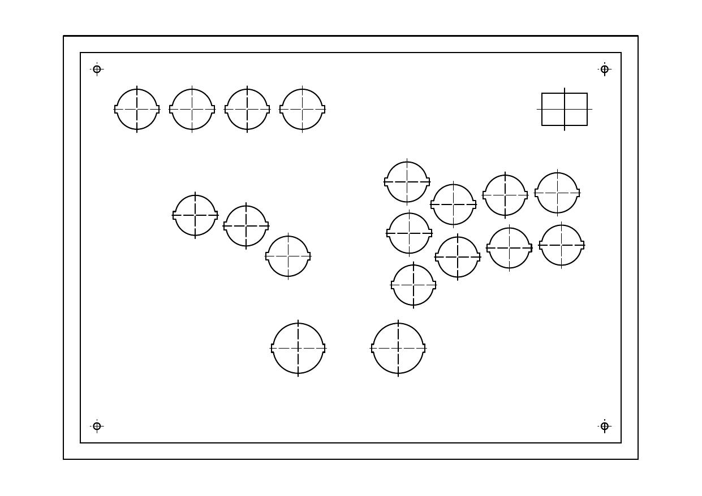
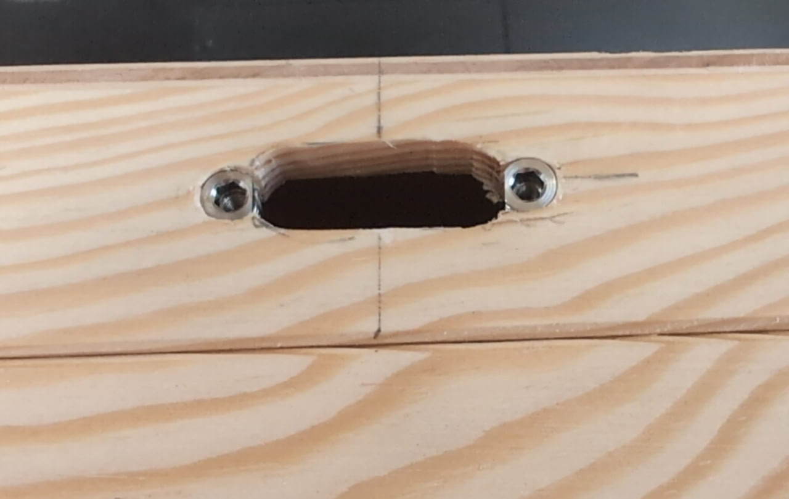
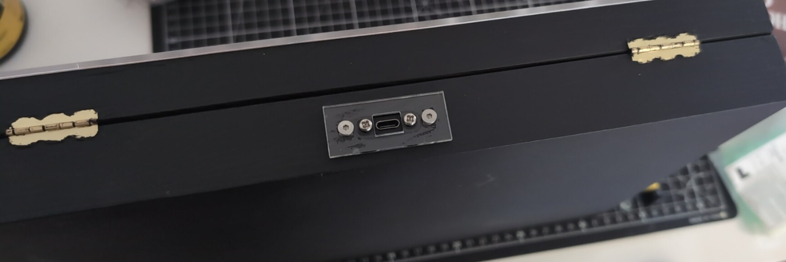

# Design Notes

## Button layout
I'm not sure why the layout where movement and attack buttons are close together is so popular. I guess HitBox really wants to show you all the cool things you can do by pressing one movement button and one attack button with the same hand. However, in practice, I've never personally seen anyone actually do that.

I've started my design by basing it on some of the artwork layouts available for controllers. I had to adjust the spacing between the buttons to accommodate for the lip. In the end, I have probably overcompensated, but it works for me - you could probably go with smaller spacing.

Afterwards, I added the additional buttons, moved the button blocks further away from each other and rotated them inwards.

The button I've used have tabs on sides, and were intended to be used with a panel thinner, than the combined width of the plywood top and acrylic sheet. That's why I've added small cutouts to the sides of the holes when cutting plywood. I've been inspired by this [reddit post](https://old.reddit.com/r/fightsticks/comments/1auxf83/custom_leverless_controller_panel_design/).

Here is how one of the final iterations of the layout looked like (prepared for manual drilling, before I decided to use a laser cutter):

### Homework
- The layout I based mine on has LK and LP buttons (in SF6 notation) almost perfectly one on top of another. I found that not as nice, because I like to press those two buttons together with my index and middle fingers. I would re-design the layout based on the flatbox, which has the bottom row shifted slightly to the left, maybe even moving it more to the left slightly.
- I believe I overdid the split between the button blocks. I would go with a gap maybe 5 mm smaller.
- I rotated each button block inwards by 12.5 degrees around the larger 30mm buttons. However, I think it is very slightly too much. Next time I would go with ~10 degrees, especially when coupled together with the previous two changes.
- I'm not very familiar with the CAD software and FreeCAD in general. As such, after making the initial layout as a sketch, I made a copy of it and rotated each button block separately, losing most of my constraints and having to re-do them manually. Please find a better way to do that.
- Similarly, I've added the notches for buttons as rectangles and then merged them in the Laser Cutter software. Trying to merge them in the FreeCAD just caused me to lose constraints, which I didn't want.

## USB mount plate
The box I've purchased didn't have enough height in the wall to mount a Neutrik-style USB port. As such, I've opted to purchase a flatter USB Type C panel mounted extender. However, I didn't realize that you are intended to screw a thin plate on top of it, not screw it to something behind it. As such, I quickly designed a plate with 2 screw holes to mount the USB extender to it, 2 screw holes to mount it to the box, and a hole for the USB cable.

Unfortunately, I placed the holes through which the plate would be mounted to the case too close to the other holes. Because I was adding furniture threaded inserts to the case (think typical brass threaded insert, but for wood), they ended up not having enough clearance and not being safely covered by the wood from all sides:

A lot of glue and wood filler eventually solved the problem, but I'm afraid to tighten the screws now. However, it works, and in theory I can disassemble the installation to replace the extender cable:

### Homework
* Use a better USB extender - I believe Punk Workshop sells a similar one, but with screw holes being further out from the body of the USB port, or use a Neutrik-style panel mounted USB port.

## Display

I've added a small cutout to fit a small OLED. However, I didn't plan for mounting it - on the layout above, you seen that I only planned a hole for the display itself. Also, I had to manually sand out a small notch for the ribbon cable on the OLED. As such, it stays in place with friction between the edges of the display and the wood, and some tape.

### Homework
* Find a good way to mount a display. If the display is not touching the surface, I think it is possible to hide the bottom part of the glass that doesn't show anything, removing the need for a cable notch altogether.