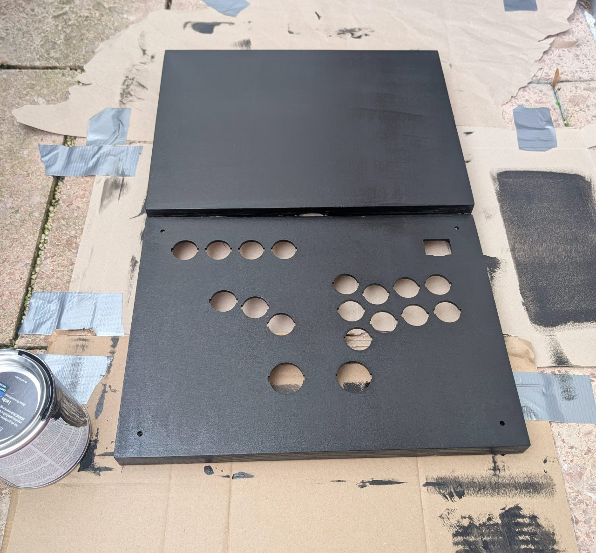

# Notes on building the controller

## Making the holes for the buttons
I was initially planning to use a drill to make holes in the top lid of the box, but kind people at the hackspace suggested trying to use a laser cutter. The lid of the box is made out of thin plywood - 3-4mm thick - and the lid itself was short enough to fit under the moving head of the laser cutter.

I was very pleased with how it turned out. I plan to design my future controller around the laser cutter.

### Homework
- None! Laser cutter rules.

## Making the hole for the USB extender

For the USB extender, I drilled a round hole of the diameter matching the height of the USB extender, and then widened it using a Dremel-like tool and files. I don't recommend that approach, as the hole was uneven, I had to file it, fill it with the wood filler, and sand it, and after painting I had to slightly sand the casing of the USB extender.

To mount the USB Extender, I had to use a mounting plate - see DESIGN.md for explanation. As I wrote there, I miscalculated the width of the threaded inserts, and ended up with suboptimal mounting.

### Homework
- Find a better approach to making a non-round hole
- Plan for more space for the threaded inserts.

## Painting

My painting experience is limited by painting small plastic dudes. As such, I didn't know where to start with painting a box made out of pine and plywood. A WikiHow article suggested using a shellac-based primer, but I couldn't really find one in my closest hardware store. I also tried using some advice from an LLM, but in retrospect it was clearly making shit up based on the techniques used for painting small plastic dudes or painting outdoor furniture. I ended up buying a can of 2-in-1 acrylic paint & primer, rated for outdoor and indoor use, supposedly also fitting for use with the toys. I think that was an OK decision, though I was later criticized for painting a relatively small DIY project "like a wood fence".

First layers looked very promising:

However, as I went on, it was clear that I was doing something wrong. Not only having to wait for ~24 hours between painting sessions seemed excessive, especially given that I had to paint my box inside and outside and on the sides, but soon enough paint started to look much worse:

It was at that point that I realized that not only did I not stir my paint, but also that I was probably using a roller incorrectly. Oh well - after approximately two coats from each side and then some after sanding down blobs of paint, I had to call it "good enough".

Thankfully, after applying a clear coat from a spray can, the texture and appearance actually improved quite a bit. I really like the satin look of the clear coat, and would go for it again:

### Homework
- When using a wooden box for case, some better painting approach should be used. Either just spraying it with the paint instead of using more generic outside paint, or some other painting approach.
- Don't forget to stir your paint first!
- The paint was so thick, that it completely glued the masking tape that I have applied to various metal parts to the box. It didn't help that because I had to open the box to paint the larger surfaces and close it to paint the sides, the masking tape didn't work as well in some places, like hinges - you can still see some paint on them, even though I did my best to scrape it or rub it off with isopropyl alcohol. In general, aim for a better masking job.

## Miscellaneous stuff

I also added some furniture gliders made from felt (see the picture above). Normally people add non-slip rubber feet to their controllers, but I haven't felt the need to - I just wanted to protect my controller from the surfaces (or vice versa), and make it a bit more comfortable to play with when wearing shorter clothing. I think it worked well enough.