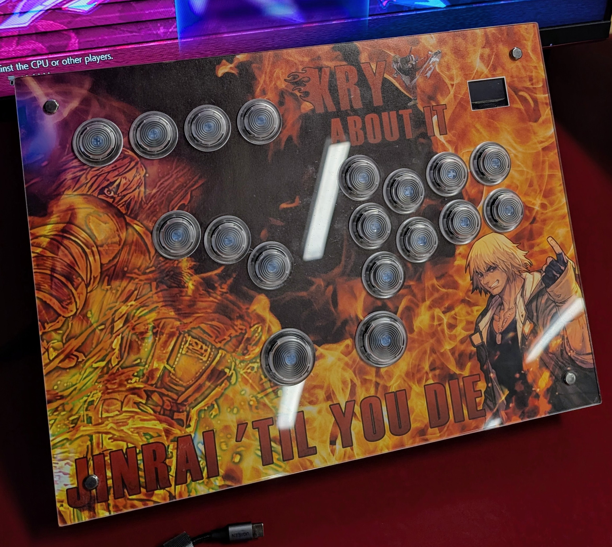

# Matchstick Box (aka Woodbox)

The goal of the project was to make a controller that would be more comfortable for people with wider shoulders through split layout (movement buttons and attack buttons separated). Additionally, it was supposed to prevent Ulnar Deviation / wrist angling by slightly tilting each button block inwards. Bigger size also helps with more comfort when placed on the knees, which is something I would typically have to do at locals.

The initial sketches for button layouts were fitting roughly on the A4 sheet of paper. As such, I opted to purchase a hobby wooden box that could fit an A4 sheet inside.

I used a laser cutter at my local hackspace to cut the lid of the box and a sheet of acrylic to go on top of it.

## Files in this directory
Notes:
- [DESIGN.md](DESIGN.md) - notes on design of the controller
- [MAKING.md](MAKING.md) - notes on actually building the controller
- [WIRING.md](WIRING.md) - notes on installing the buttons and wiring them

Other files:
- [ButtonLayout.FCStd](ButtonLayout.FCStd) - the layout of the buttons and cutting layout for the case and acrylic plate, see [DESIGN.md](DESIGN.md) for notes.
- [USBPortMountPlate.FCStd](USBPortMountPlate.FCStd) - extra detail to help mount the USB port extender to the case, see [DESIGN.md](DESIGN.md) for notes.