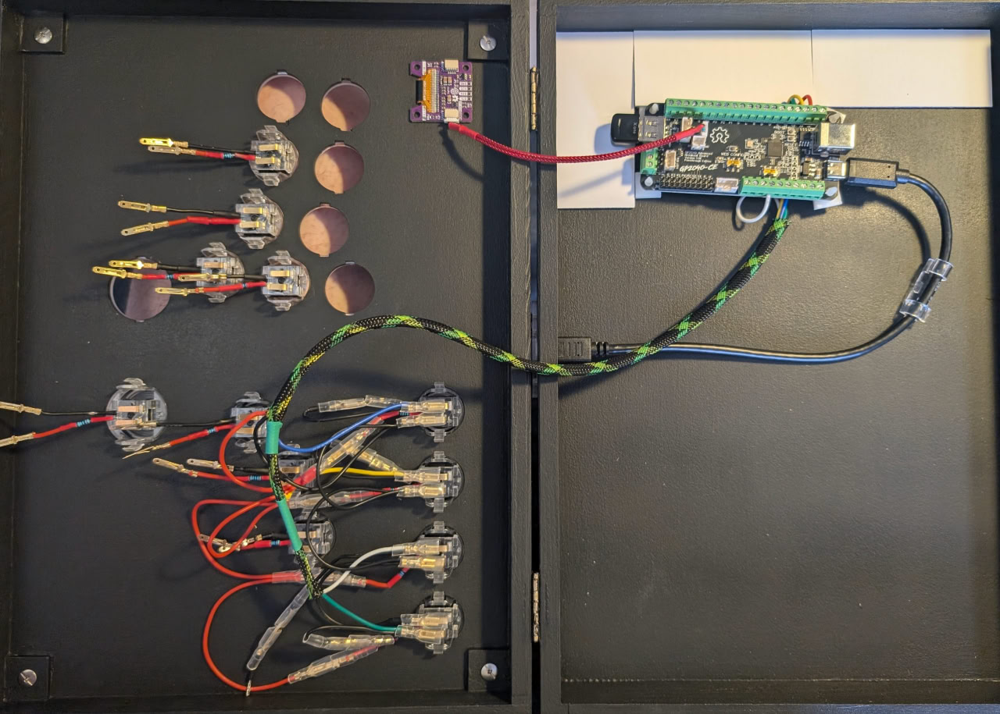
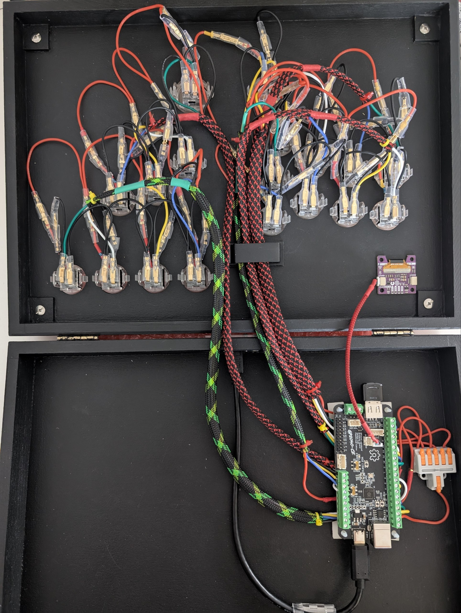

# Notes on wiring the controller

## Buttons

I've purchased a set of Punk Workshop buttons on AliExpress. I quite enjoyed having keyboard switches in my flatbox, and as such, chose the buttons which used them. The listing seems to be gone from the reseller, but they are listed as "PWS v1" on Punk Workshop webstore - albeit with button caps seemingly being deeper in the button case.

These buttons use 2.8mm terminals. I've bought a set of male and female 2.8mm terminals with covers for wiring, but I didn't enjoy using them - they are very hard to insert and remove - I would look for something more akin to what is used in the Brook harness.

## LEDs

When I received my buttons, I've noticed that the switches inside of them (Cherry MX Blue) had a small place for an LED in them. Turns out that those switches perfectly fit a 3mm LED. The button housing didn't have any holes for the diode legs, but if I bent the legs at the bottom of the switch, I could have them sticking out from the side of the button:

TODO picture of switch and LED

TODO picture of button with LED legs visible

As such, I made a decision to add an LED to the buttons. GP2040-CE has its own support for addressable LEDs, but it would be difficult to fit one into the switch, so I decided to make them activate on the button press.

I have found that GP2040-CE configures its buttons such that when pressed, they pull the pin down to the ground. With that knowledge, I was able to connect the anode of the LED to the VCC pin, and the cathode to the GPIO pin. This way, when the button is pressed, the circuit will close, and an LED will light up, but if LED dies, the button won't stop working.

TODO schematic of LED

### Small note on LEDs
The Cherry MX switches (non-RGB version) fit 3mm LEDs, however I've discovered that depending on the color, some LEDs' skirts needed to be slightly sanded down to fit into the switch, while others fit perfectly or even slightly loose. Your mileage may vary, but in my experience, yellow and red LEDs fit snugly, green LEDs are a bit loose, and blue and white LEDs needed to be sanded down. Other switches may expect different size of LEDs, for example 1.8mm.

### Homework
- I wanted to make it so I don't need to de-solder anything to remove the button. To achieve that, I've soldered 2.8mm terminals, same ones used by the buttons, to the legs of LEDs. I've also soldered a resistor to the LED instead of to the cable going to it. However, this proved to be a bad decision, because all of it takes too much space and looks really messy at the end:

- Next time, I would probably look for some sort of connection which would fit the legs of LEDs and hold them firmly, similar to how hot swap sockets for keyboard switches work.
- Either because the VCC pin on the board is 5V and the logic pins are pulled up to 3.3V or for some other reason, some LEDs, namely reds and to a lesser extent yellows, can be faintly seen glowing when not pressed. That's probably not great for their longevity.

## Component placement

I've made a decision to have the GP2040 board at the bottom part of my case, with cables going to the top part. This was done partly because the pre-crimped JST SH 1.0mm (a.k.a. QWIIC) cables I had that I used to connect an OLED were really short, and because the USB extender was mounted in the bottom part. That worked out in the end, but next time I would try to have all of the components mounted on the same surface.

Also, I didn't plan a proper mounting for OLED. I couldn't use the same stands that the board uses, since they would cover the screen. For now, it stays put with friction and some tape.

### Homework
- Plan for the board to be on the same surface with the buttons.
- Plan better mounting for the OLED.

## Wiring

Although I've bought a pre-made cable harness for leverless controllers, I didn't want to use it since the pin grouping wasn't working for me, and I was worried that the 20 pin connector would make the board too tall. I ended up making my own cable harnesses, intended to be connected to the screw terminals on the GP2040 board.

TODO picture of harness

I've used 22 AWG wires. I think they are a bit on the thicker side, especially when compared to the typical wiring job, but I think they worked well with the 2.8mm terminals that I've used, though I couldn't fit 2 cables together inside the terminal for crimping without fully removing the isolation. Next time, I would probably go with something slightly smaller, but definitely thicker than 30 AWG.

### Notes on sleeving
I wanted to sleeve my cables for cleaner (and cooler) look. For that, I bought some various cable sleeves.

For 22 AWG cables, I would say a cable sleeve with maximum internal diameter of 6mm can fit 4-5 wires comfortably, 6 if you're pushing it. I wired my buttons in groups of at most 4, so I needed 4 wires to each GPIO pin, 1 common Ground wire, and one common VCC cable. I used 6mm (green on pictures) and 12mm (red) sleeving. Next time, I would probably go with 8mm cable sleeving, unless I would go for thinner wires.

It is possible to cut the sleeving and make holes in it to let some cables out earlier, but you need to treat the cut with head to seal it up and prevent it from unraveling. I used a lighter, but flames were probably too wide to make it a clean job. I would suggest you look for a dedicated cutter tool at your local workshop for a cleaner cuts.

There are various methods of routing your cable through sleeving, but I found it very easy to just stretch the sleeving over a metal drinking straw, feed the cables through it, and then slowly pull the sleeving out alongside the cables.

### Homework
- Some of the cables I made were a bit too short and had to stretch out, some of them were a bit too long. Next time, I would plan better for the cable placement together with the component placement and try to go for neater cables. Same goes for sleeving.
- For my LED cable terminals, I have added a silicon sleeve that came with the terminals to both sides of the cable. I now think that this may have been excessive - similar to the terminals on the buttons, you probably could only use one cover on one side.
- I tied the ends of the sleeves with small colorful zip ties. I would get some more colors next time for easier identification of sleeves, and maybe also add some heat shrink tubing at the ends of the cut to seal it up even further.
- It was later that I have found a guide for wiring fighting game controllers. [Link to the guide](https://drive.google.com/file/d/1Ho5ItRj8jMYTG4tVbq0kyc-aFqbbF-iD/view?usp=sharing). There were some interesting techniques there, like reverse-crimping of 2.8mm terminals on wires, as well as an advice to not cut the sleeves to pull out cables, rather just pushing the strands of the sleeve aside for a cleaner job.